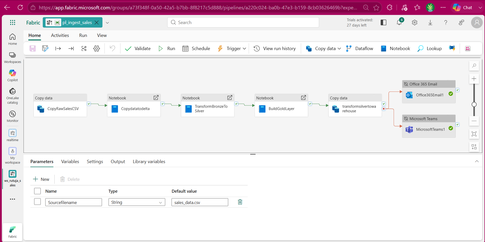
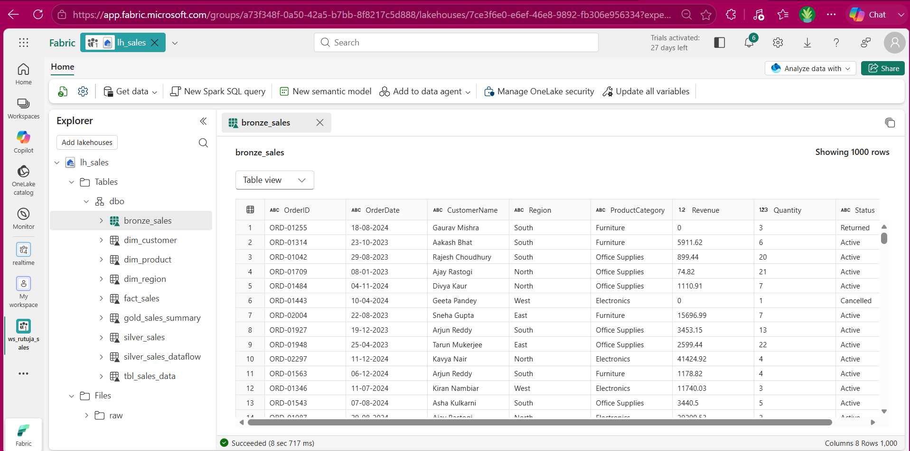
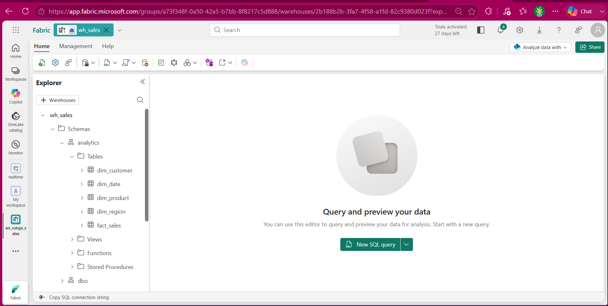
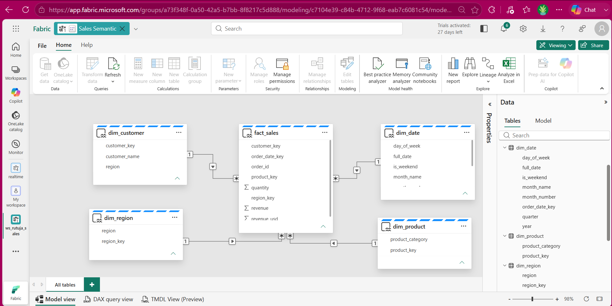
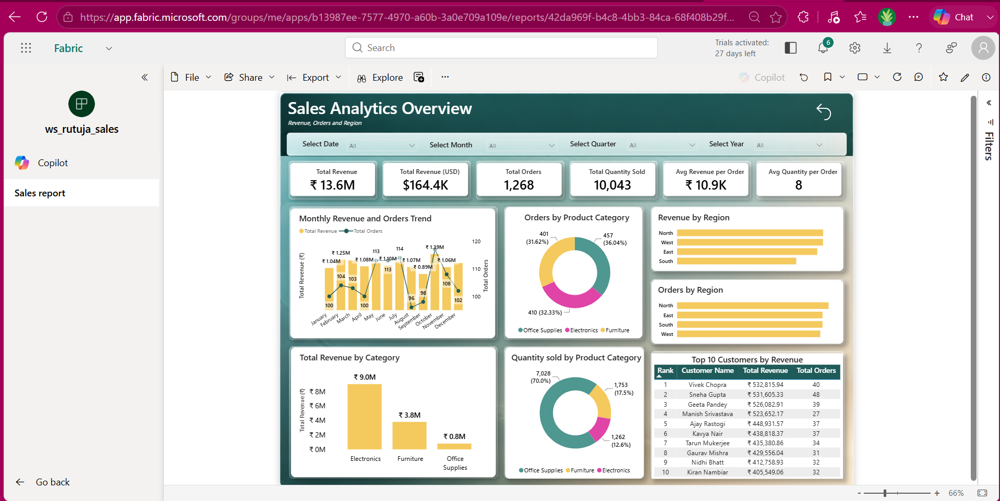

# Sales Analytics

An end-to-end sales analytics project built on **Microsoft Fabric**, covering data ingestion, transformation, storage, data modeling, and reporting.

## Project Flow

The project follows this flow:

**Raw CSV → Data Pipeline → Lakehouse → PySpark transformations → Data Warehouse → Semantic Model → Power BI Dashboard**

The implementation uses a Medallion Architecture for the Lakehouse layer, followed by a dimensional model in the Warehouse and a Power BI report connected through a semantic model.

## 1. Data Source

The source is a sales CSV file hosted through a raw GitHub URL:

[Sales Data CSV](https://raw.githubusercontent.com/the-mansi-goel/FABRIC/refs/heads/main/sales_data.csv)

The data contains sales-related fields such as order details, dates, customers, regions, product categories, revenue, quantity, and status.

---

## 2. Data Pipeline

The Fabric pipeline handles the movement and transformation of the data.

The pipeline contains these main steps:

- **CopyRawSalesCSV** – copies the raw CSV data into the Fabric environment.
- **Copydatatodelta** – loads the data into Delta/Lakehouse storage.
- **TransformBronzeToSilver** – cleans and transforms the Bronze data into the Silver layer.
- **BuildGoldLayer** – prepares the Gold layer for analytical use.
- **transformsilvertowarehouse** – moves the prepared data from the Lakehouse into the Warehouse.
- **Office365Email1** and **MicrosoftTeams1** – notification activities connected to the pipeline flow.

A pipeline parameter, `Sourcefilename`, is also used for the source file name (`sales_data.csv`).

---

## 3. Lakehouse

The Lakehouse is used as the main storage and transformation layer.

The data is organized using **Medallion Architecture**:

- **Bronze** – keeps the ingested/raw sales data.
- **Silver** – contains cleaned and transformed sales data.
- **Gold** – contains prepared analytical data and summaries.

The Lakehouse contains tables including:

- `bronze_sales`
- `silver_sales`
- `silver_sales_dataflow`
- `gold_sales_summary`
- `fact_sales`
- `dim_customer`
- `dim_product`
- `dim_region`
- `tbl_sales_data`

The Lakehouse also exposes a **SQL analytics endpoint** for querying the stored data.

---

## 4. Data Warehouse

The transformed data is loaded into a Fabric **Data Warehouse** for structured analytical reporting.

The Warehouse uses a **Star Schema** with:

- `fact_sales` – central sales transaction table.
- `dim_customer` – customer information.
- `dim_product` – product category information.
- `dim_region` – regional information.
- `dim_date` – date, month, quarter, year, and calendar attributes.

This structure separates measurable sales data from descriptive dimensions and makes it easier to create consistent analytical queries and Power BI measures.

---

## 5. Semantic Model

The **Sales Semantic** model sits between the Warehouse and the Power BI report.

The model connects `fact_sales` with the dimension tables and provides the relationships used for reporting. The date dimension contains fields such as `full_date`, `month_name`, `month_number`, `quarter`, and `year`.

DAX measures are used for the main sales KPIs, and **Row-Level Security** is applied so regional managers can be restricted to their assigned regional data.

---

## 6. Power BI Dashboard

The final Power BI report is built using **DirectLake** and provides an overview of revenue, orders, quantity, regions, and product categories.

The dashboard includes:

- Total Revenue
- Total Revenue (USD)
- Total Orders
- Total Quantity Sold
- Average Revenue per Order
- Average Quantity per Order
- Monthly Revenue and Orders Trend
- Revenue by Region
- Orders by Region
- Revenue by Product Category
- Quantity Sold by Product Category
- Top 10 Customers by Revenue
- Date, Month, Quarter, and Year filters

The report provides a single place to explore sales performance across different time periods, regions, customers, and product categories.

---

## Project Summary

This project demonstrates how Microsoft Fabric can bring data ingestion, transformation, storage, modeling, and reporting together in a single analytics platform.
The complete flow from raw sales data to the final Power BI dashboard provides a practical example of building an end-to-end analytics solution using Fabric.